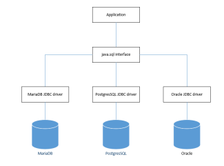
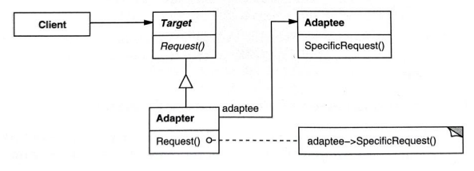

# Adapter
- a structural design pattern

## Idea of Adapter DP
- allows incompatible interfaces to work together
- transforms the interface of a class into another interface the client expects
- >this is done by a dedicated adapter class

## Example: database drivers

- database drivers are adapters 
- this application uses the same interface irrespective of the underlying database management system

## General structure of Adapter DP

- an object adapter wraps the Adaptee (contains a reference to the Adaptee object)
- a class adapter implements both the Target and Adaptee interfaces
- note: Java doesn't support multiple inheritance present in the original Gamma's diagram
- >solution: the Adapter implements, not extends, the Target
  
### Roles 
- **Target Interface**: defines the domain-specific interface
- **Client**: interacts with object conforming to the Target Interface
- **Adaptee**: an existing interface that needs adapting
- **Adapter**: adapts the interface of the **Adaptee** to the Target Interface

## Practical issues
- can even add functionality that is not present in the adaptee
- adapters can vary in complexity
- an adapter may provide default behavior that allows it to function even without a wrapped adaptee
- an object adapter can utilize several adaptee classes (superclasses and subclasses)

