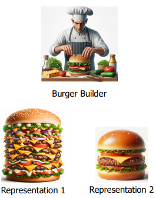
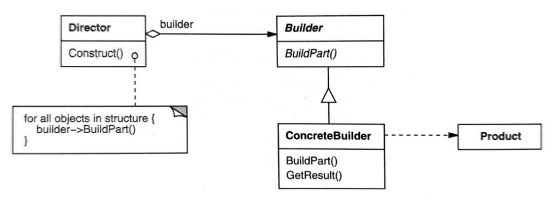
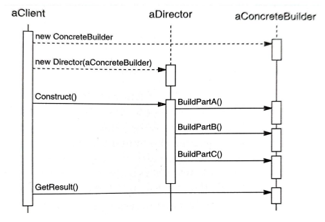

# BUILDER
- Is a creational design pattern

## Idea of Builder DP
- makes it easier to build a complex object step by step
    >eliminates need for a complex 'telescoping' constructor
- separates the constructions of a complex object from its representation
    >representation means how the object looks, how it functions and what interfaces it implements
- allows the same construction process to create different representations
- enhances code modularity and flexibility
- 

## General structure of Builder DP

- **Builder Interface**: defines the steps to construct the product
- **Concrete Builder**: implements the builder interface to construct and assemble parts of the product
- **Director**: orchestrates the construction process using the builder interface
- **Product**: the complex object that is being built

## Construction of objects (sequence diagram)

aClient -> the user of the system
- new ConcreteBuilder()
- creates a ConcreteBuilder
- builder knows how to build each part of the product

- new Director(aConcreteBuilder)
- client passes the builder to the **Director**
- now the director will use that builder to construct the object

- Construct()
- client tells director: "build the product"
- client does NOT build anything

aDirector -> controls the building process 
- director calls the builder's methods in order
- Director decides the sequence of building the product

aConcreteBuilder -> actually builds the object (the worker)
- the ConcreteBuilder executes the work
- each method adds a part to the final product

## Getting result
- the Client fetches the result directly from the Concrete Builder
- this approach provides the client with the specific type that the Concrete Builder is responsible for creating
- any Director can work with any ConcreteBuilder
- Products don't need to share a common interface

## Practical issues
- this pattern can introduce unnecessary complexity if the project does not require object creation 
- >can increase number of classes and overall size of the codebase, each new type of product requires a new concrete builder class
- may obscure the final product representation from the client
- readability of the client code can suffer
- >a sequence of builder method calls can be less clear than setting properties directly on an object

